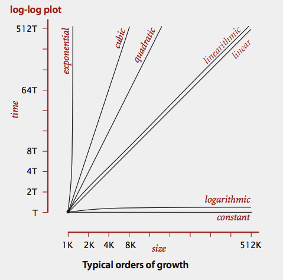

# Analysis of Algorithms
  * [Order of Growth Examples](#order-of-growth-examples)
  * [Memory Examples](#memory-examples)



## Order of Growth Examples

What is the order of growth of the worst case running time of the following code fragment
as a function of N?

```
int sum = 0;
for (int i = 1; i*i <= N; i = i*4)
    sum++;
```
[Answer 1](#oog1)

```
int sum = 0;
for (int i = 1; i*i <= N; i = i*2)
    for (int j = 0; j < i; j++)
        sum++;
```
[Answer 2](#oog2)

```
int sum = 0;
for (int i = 0; i < N*N; i++)
    for (int j = i; j < N; j++)
        sum++;
```
[Answer 3](#oog3)

## Memory Examples

## Order of Growth Answers

### oog1
log N => The i loops iterates ~ log_4 (N^1/2) ~ lg N times.

### oog2
N^(1/2) => The body of inner loop is executed 1 + 2 + 4 + 8 + ... + sqrt(N) ~ 2 sqrt(N) times.

### oog3
N^2 => The i loop iterates N^2 times; the body of the j loop executes only when i < N.
